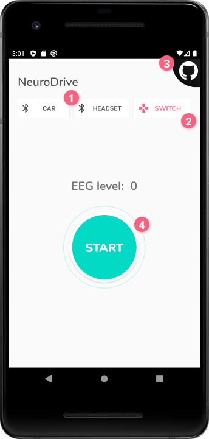
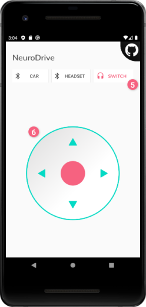
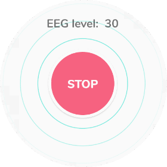

# Mini project: NeuroDrive

## [Check out our system demo video on youtube](https://youtu.be/pvArIKRuUSM)
In order to demo our end product, we have recoded a short video demonstrating the functionality of our system. We hope the video gives you a good idea of what we've been trying to achieve. Thanks for watching!

## Table of contents
1. [What does this repository contain?](#what)
2. [Why did we develop this?](#why)
3. [How did we reach these results?](#how)
4. [Resources we used](#resources)
5. [Application user manual](#application-user-manual)
6. [Hardware user manual](#hardware-user-manual)
7. [Hardware and software architecture](#hardware-and-software-architecture)
8. [Team members](#team-members)

## What?
A software that allows an end user to remotely control a smart car in a less traditional way, with the use of an EEG-headset and a mobile app. Moreover, the smart car can prevent itself from hitting obstacles in front and behind it by turning to the opposite direction.

## Why?
The main objective of this software is to utilize and demonstrate the use and application of EEG (Electroencephalography) readings to external hardware. By exploring this domain we hope to demonstrate ways using software engineering to develop for people with different levels of mobility. One of our goals was to showcase the ability to control a car without the use of hands.

## How?
The EEG-chip within the “Force Trainer II Bluetooth Headset” measures brain, and depending on the users’ mental state e.g. stressed or relaxed, the headset will pick up frequencies within different Hz intervals. With the data retrieved from the headset, we will be able to control the forward throttle of the car, while being able to steer right and left via tilting the phone.
The smart-car will also be able to prevent itself from colliding with obstacles by using ultrasonic sensors. Once the ultrasonic wave reaches obstacle it bounces back and the displacement between the car and the wall is calculated, and once it is too short the car will turn to the opposite direction.

## Resources
| Hardware | Software |
| --- | --- |
| 1x Smartcar | Smart Car shield library |
| 8x AA rechargeable batteries | Java |
| 2x SR04 Sensors | C++ |
| 1x MicroUSB cable | Travis CI |
| [Bluetooth EEG headset](https://estore.nu/sv/star-wars/5028-star-wars-force-trainer-ii-8001444158953.html?SubmitCurrency=1&id_currency=1&gclid=EAIaIQobChMIoN7K4YrC6AIV2OeaCh3drQbnEAQYASABEgJZZfD_BwE) | [Neurosky android developer tools](https://store.neurosky.com/products/android-developer-tools-4) |
| Android OS with version Lollipop(5.0) or higher | Google fonts, [Nunito](https://fonts.google.com/specimen/Nunito) |

## Application user manual

### Application header
1. The application UI indicates to the user that external hardware can be connected to via Bluetooth.
2. If tapped, the ‘Switch’ button will switch the contents of the UI screen from EEG reading smart car control, to manual smart car control.
3. The github button takes any curious app users to the project repository.

### Mind control view
4. The application user can enable and disable EEG readings from the headset.

### Manual control view
5. In order to return to the previous UI screen content, the app end-user can tap the ‘Switch’ button again.
6. The app end-user can control the smart car manually with the help of a joystick. This is done by pressing down on the screen within the borders of the joystick trackpad, while moving their finger in the displayed directions.

### Visual EEG readings

The application will start to display the levels of EEG received by the end-user wearing the headset while EEG readings are enabled. This is visualized both with a text displaying the exact level of the reading, as well as an animation that changes when the reading goes up or down.

## Hardware user manual
### EEG headset
Headset has a toggle switch and users should switch off after use. When the headset is on, the blue light should blink. One rechargeable triple-battery is in the headset. When the headset is turned on and battery is low the blue light will turn red and blink.

### Arduino smart car
The smart car has an on-off switch on its side, and users should switch off after use. When the car is turned on, a red light should start glowing on top of the smart car.

## Hardware and software architecture
### Arduino software
### Hardware

NeuroDrive is controlling a smartcar, a vehicle platform used for [educational purposes.](https://github.com/platisd/smartcar_shield) 
The smartcar is equipped with an ESP32 microcontroller. When the smartcar.ino sketch is uplodaded to the ESP32 the smartcar will have all features described:
Two SR04 Sensors are always active and reading distances up to 1 metre.

handleInput() - Allows bluetooth communication with the car. The car is able to move in 8 degrees.
rotateOnSpot() - Activates whenever an object is within 20 cm from the front or rearend of the car.
SimpleTimer cooldown - Used to temporarily disable the sensors, since otherwise one of them would always detect the obstacle.
Changespeed - A method used to ensure that the system is stable by adding a delay whenever the motors are changing direction.

!!DISCLAIMER!!
NeuroDrive is not assosicated with NeuroSky but is dependent on an algorithm created by them to function.
Their algorithm allows communication between the TGAM inside the Force Trainer II and the NeuroDrive Application.
If this software was (for some reason) ever to be used in it must comply with Neurosky EULA.

### Application software
The android application consists of one main activity java file which uses xml resources and java classes to build the functionality and structure as follows:

#### Java files
| Filename | Purpose / function |
| --- | --- |
| [MainActivity.java](https://github.com/DIT112-V20/group-08/blob/clean-up/app/app/src/main/java/com/example/myapplication/MainActivity.java) | Main application java file. Contains and implements application functionality. |
| [Connector.java](https://github.com/DIT112-V20/group-08/blob/clean-up/app/app/src/main/java/com/example/myapplication/Connector.java) | A class file with methods FindBT(String name) - enables bluetooth on device and searches for paired devices that matches the bluetooth device name. The second method openBT() opens a socket to said device.
| [JoyStick.java](https://github.com/DIT112-V20/group-08/blob/clean-up/app/app/src/main/java/com/example/myapplication/JoyStick.java) | A class file with method onTouchEvent() - calculates the axle x, axle y, direction, angle and power on the joystick. The second method calculateDirection(Double degrees) - enables both joystick and smart car have the same directions. |
| [PulseView.java](https://github.com/DIT112-V20/group-08/blob/clean-up/app/app/src/main/java/com/example/myapplication/PulseView.java) | Custom view that generates an animation which changes dependent on values recieved in MainActivity.java |

#### XML layout resource files
| Filename | Purpose / function |
| --- | --- |
| [activity_main.xml](https://github.com/DIT112-V20/group-08/blob/clean-up/app/app/src/main/res/layout/activity_main.xml) | Main application activity content. Container that includes content files. |
| [content_header.xml](https://github.com/DIT112-V20/group-08/blob/clean-up/app/app/src/main/res/layout/content_header.xml) | Structures the application header that holds buttons to connect to hardware and change the application activity contents. |
| [content_eeg.xml](https://github.com/DIT112-V20/group-08/blob/clean-up/app/app/src/main/res/layout/content_eeg.xml) | Contains elements related to EEG readings and visuals that display concentration levels to the end-user, as well as allows the end-user to toggle EEG readings on and off. |
| [content_joystick.xml](https://github.com/DIT112-V20/group-08/blob/clean-up/app/app/src/main/res/layout/content_joystick.xml) | Contains joystick view which lets the end-user manually control the smart car, instead of reading EEG concentration levels. |

#### XML values resource files
| Filename | Purpose / function |
| --- | --- |
| [attrs.xml](https://github.com/DIT112-V20/group-08/blob/clean-up/app/app/src/main/res/values/attrs.xml) | So far only contains joystick related attributes. Can be changed later to include attributes for other custom views. |
| [colors.xml](https://github.com/DIT112-V20/group-08/blob/clean-up/app/app/src/main/res/values/colors.xml) | Contains application UI color palette. |
| [font_certs.xml](https://github.com/DIT112-V20/group-08/blob/clean-up/app/app/src/main/res/values/font_certs.xml) & [preloaded_fonts.xml](https://github.com/DIT112-V20/group-08/blob/clean-up/app/app/src/main/res/values/preloaded_fonts.xml) | Contains the custom Google Fonts that were implemented into the UI design. |
| [strings.xml](https://github.com/DIT112-V20/group-08/blob/clean-up/app/app/src/main/res/values/strings.xml) | Contains all strings used in the app UI. |
| [styles.xml](https://github.com/DIT112-V20/group-08/blob/clean-up/app/app/src/main/res/values/styles.xml) | This file contains UI style attributes that could be repeated in different layout elements. Style attributes that are never repeated are written inline in the UI element. |

#### XML drawable resource files
| Filename | Purpose / function |
| --- | --- |
| [icon_bluetooth_connected.xml](https://github.com/DIT112-V20/group-08/blob/clean-up/app/app/src/main/res/drawable-v24/icon_bluetooth_connected.xml) & [icon_bluetooth_disconnected.xml](https://github.com/DIT112-V20/group-08/blob/clean-up/app/app/src/main/res/drawable-v24/icon_bluetooth_disconnected.xml) | Vectors icons used to illustrate Bluetooth connectivity. |
| [icon_controls.xml](https://github.com/DIT112-V20/group-08/blob/clean-up/app/app/src/main/res/drawable-v24/icon_controls.xml) & [icon_headset.xml](https://github.com/DIT112-V20/group-08/blob/clean-up/app/app/src/main/res/drawable-v24/icon_headset.xml) | Vector icons that illustrate to the user which type of content to view in activity_main.xml. This is toggled by visibility settings. |
| [icon_github.png](https://github.com/DIT112-V20/group-08/blob/clean-up/app/app/src/main/res/drawable-v24/icon_github.png) & [btn_github.xml](https://github.com/DIT112-V20/group-08/blob/clean-up/app/app/src/main/res/drawable/btn_github.xml) | Icon used to indicate to the end-user that a github repository is available via an external link. |
| [bg_eegcontrol_start.xml](https://github.com/DIT112-V20/group-08/blob/clean-up/app/app/src/main/res/drawable/bg_eegcontrol_start.xml) & [bg_eegcontrol_stop.xml](https://github.com/DIT112-V20/group-08/blob/clean-up/app/app/src/main/res/drawable/bg_eegcontrol_stop.xml) | Background xml shape files that visualise the EEG concentration readings being turned off and on. |
| [joystick_trackpad_background.xml](https://github.com/DIT112-V20/group-08/blob/clean-up/app/app/src/main/res/drawable/joystick_trackpad_background.xml) | Vector graphics used in the background of the joystick. |

## Team members
| Name | Project contribution |
| --- | --- |
| [Liv Alterskjaer](https://github.com/liivmarii) | Android application UI design and front end development: Animation, view layouts and custom views, micro interactions, toast notifications, and vector graphics. |
| [Annan Lao](https://github.com/AnnanLao) | Part of the android backend logic, including car manual control and url link; and night mode design and logic. |
| [Zhijie Wei](https://github.com/ZJW-92) | Joystick and its backend logic in manual control mode. |
| [Douglas Johansson](https://github.com/dojodj) | Obstacle avoidance, testing, hardware installations. |
| [Mattias Ekdahl](https://github.com/matekd) | Car logic, obstacle avoidance and app backend for communication with the car. |
| [Simon Engström](https://github.com/Simonster1999) | Backend logic for mind control mode. Backend logic for bluetooth connections and UI connection micro interactions. |
